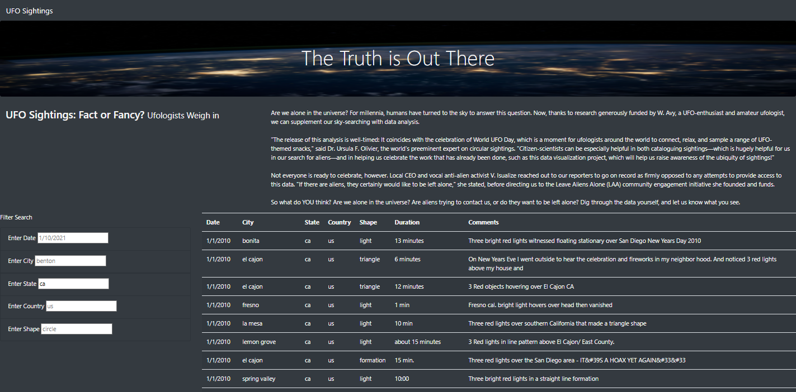

# UFOs

## Project Overview
The purpose of this project is to create a webpage that allows users to view UFO sightings that match a certain user-inputter search criteria.

## Results

After completing the coding, the webpage looks as shown above.

The top portion of the webpage contains navigation bar, jumbotron, and article title and paragraph. 
The bottom portion of the webpage contains a table of all UFO sightings, with a empty filter search.

In order to use the webpage to search for UFO sightings based on a certain criteria, the user shall input some value into the available search filters (shown below):

[FILTER SEARCH IMAGE]

For example, if someone enters "1/13/2010" into the "Enter Date" portion of the Filter Search, the UFO Sightings table will filter the results to display only the sightings with date "1/13/2010", as shown below.

[TABLE FILTERED]

Various other filters can be entered to filter the table further. For example, "white oak" may be entered into the "Enter City" portion of the filter. The UFO sighting filter will be further filtered to show the following:

[TABLE FILTERED 2]. 

## Summary
Although the webpage sufficiently allows a user to search for UFO sightings based on certain criteria, there are a few drawbacks.

One drawback is that the Filter Search only works when the searched criteria perfectly matches the value in the table. For example, if one were to filter the table to only show Sightings that took place in California, "ca" must be entered into the Filter Search. Similiar searches, such as "CA" or "California" will NOT return ANY results, as shown below. 

[search State]

Due to this, I would make two recommendations:
1. Alert the user when the Filter Search does not return any results.
2. Change the code so that the Case does not matter when using the Filter Search. 

